# 👩‍💻 Gabriela Riscica

🎓 MSc Computer Science Student @ University of Catania  
🤖 Artificial Intelligence • ⚛️ Quantum Computing • 💻 Software Development  

---

## 🚀 About Me
- 🎓 BSc in Computer Science (110/110 cum laude), University of Catania  
- 📚 Thesis: *Dog Breed Recognition using Deep Learning*  
  
  
  
  
    

- 💻 Programming languages:  
  
  
  
  
    

- 🔬 Tools:  
  
    

---

## 🛠️ Tech Focus
- 🤖 Artificial Intelligence & Machine Learning  
- ⚛️ Quantum Mechanics & Quantum Computing  
- 💻 Software Engineering & Data Analysis  

---

## 📊 GitHub Stats

---

## 🚀 Featured Projects
- [**Dog Breed Recognition (Thesis Project)**](#)  
  Deep Learning project for **automatic dog breed classification**.  

- [**Library Database Management System**](#)  
  Academic project for designing a **relational database** for a library.  

---

## 🌍 Languages
- 🇮🇹 Italian: Native  
- 🇬🇧 English: B1  
- 🇫🇷 French: B2  

---

## 📫 Contacts
- 💼 [LinkedIn](https://linkedin.com/in/yourprofile)  
- 📧 [Email](mailto:youremail@example.com)  

---

⭐ *If you like my work, consider leaving a star on my projects — your support means a lot!*  
